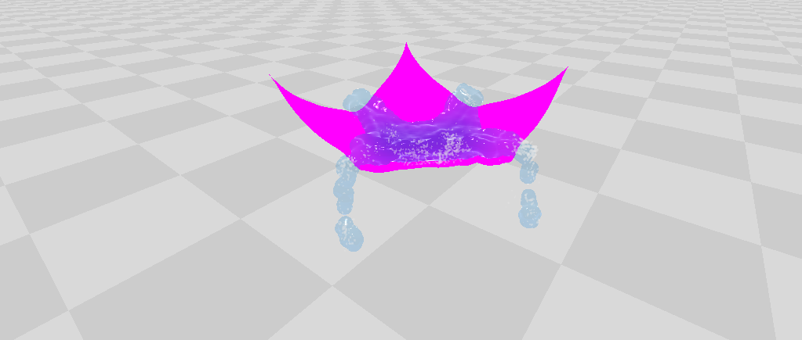

### A CUDA/C++ Fluid-Cloth Coupling ###

*1k fluid particles were dropped onto a cloth of 4k vertices. Two-way interaction is realized, evident by the fluid pushing the cloth down.*

### Overview ###
This is a follow-up project to my [Position Based Fluids](http://jagj10.github.io/projects/pbf.html) implementation.
<pre></pre>
My goal with this project was to develop an application in the spirit of [NVIDIA's FleX framework](https://developer.nvidia.com/physx-flex) which allows particles of different types to interact without the difficulties usually encountered when integrating several different physics systems. Similar to FleX, I built my application on top of the Position Based Fluids framework which has several nice properties, such as efficient neighbor finding using a uniform grid. Using the same radius for all types of particles allows the contacts to be solved in an efficient way by generating special contact constraints between interacting particles before the general constraint loop. My implementation currently consists of just Cloth and Fluid, but would easily be extensible to rigid bodies and smoke particles as well. The rendering was all done using OpenGL and the physics is performed in parallel on the GPU and runs in real-time at interactive framerates (depenedent on resolution of the simulation, of course).
<pre></pre>
This project was developed during Spring 2015.
<pre></pre>
The code is also available at my [github repository](https://github.com/JAGJ10/PositionBasedFluids).

### Features ###
- **Position Based Fluids** - The method behind the fluid simulation. It is a lagrangian-based system which utilizes a Jacobi-style update allowing all particles to be run in parallel on the GPU.
- **Position Based Dynamics** - The method behind the cloth simulation. Particles have basic spring (distance) constraints between them which will push or pull in order to keep it stable. Stretching, shearing, and bending are all simulated and can be controlled easily via parameters.
- **Dynamic Contact Constraints** - Before the general constraint solve (fluid and cloth), the grid updates all particle neighbors and contacts between particles of different phases are dynamically updated. These constraints are simple distance constraints though they only act to push rather than pull so as to keep particles from penetrating each other. This prevents tunneling: fluid passing through cloth.
- **Long Range Attachments** - This simple method is used with "pinned" vertices in the cloth and helps create a much more stable simulation. Every non-pinned particle in the cloth has a simple distance constraint with the pinned particle that only acts once the distance exceeds the initial distance. This prevents over-stretching and helps convergence in the Jacobi updates.

### Acknowledgments ###
I would like to personally thank Professor [Doug James](http://www.cs.cornell.edu/~djames/) and [Tim Langlois](http://www.cs.cornell.edu/~langlois/) for their help and constant willingness to answer any and all questions.

### Future Work ###
Given the flexibility of the system, there is a lot of potential for future development (as seen by NVIDIA's developing framework upon which this project was based). Possible improvements include better rendering, dynamic cloth tearing (through constraint removal), rigid body physics, smoke, granular materials, and deformation. 

### Video ###
<iframe width="1280" height="720" src="https://www.youtube.com/embed/OuG6TPz9fAw" frameborder="0" allowfullscreen></iframe>

### Resources ###
- [Position Based Fluids](http://jagj10.github.io/projects/pbf.html) - Please see my other project page for a description of how the fluid was created
- [Unified Particle Physics](http://mmacklin.com/uppfrta_preprint.pdf) - The chief resource used and upon which my implementation was based. This system represents the next-generation of particle physics in games.
- [Position Based Dynamics](http://matthias-mueller-fischer.ch/publications/posBasedDyn.pdf) - The method used for simulating cloth. The implementation in FleX and my own is a little simpler since bending and shearing are basic distance constraints rather than the original model.
- [Long Range Attachments](http://matthias-mueller-fischer.ch/publications/sca2012cloth.pdf) - A simple improvement on Position Based Dynamics that creates a more stable simulation with less iterations.
