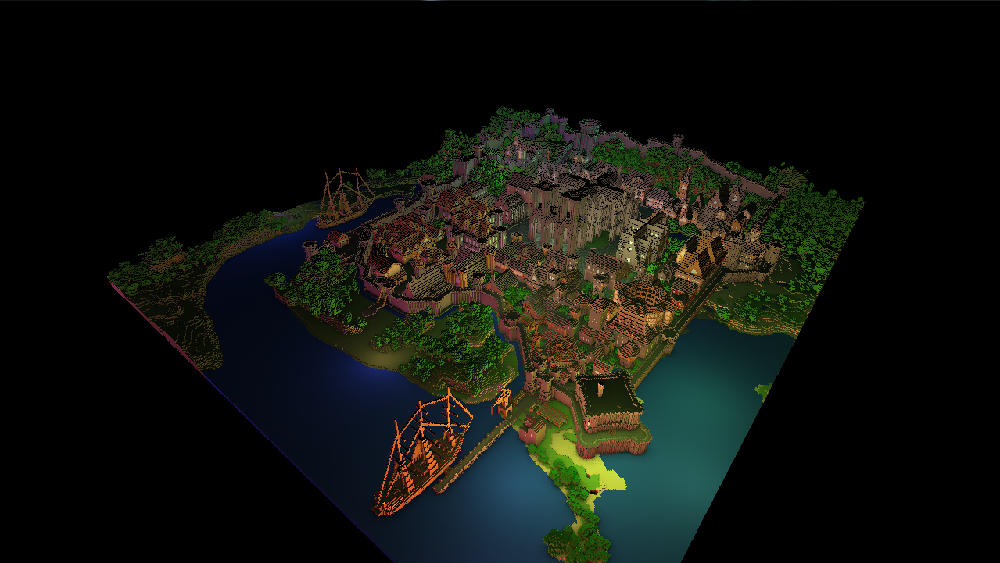
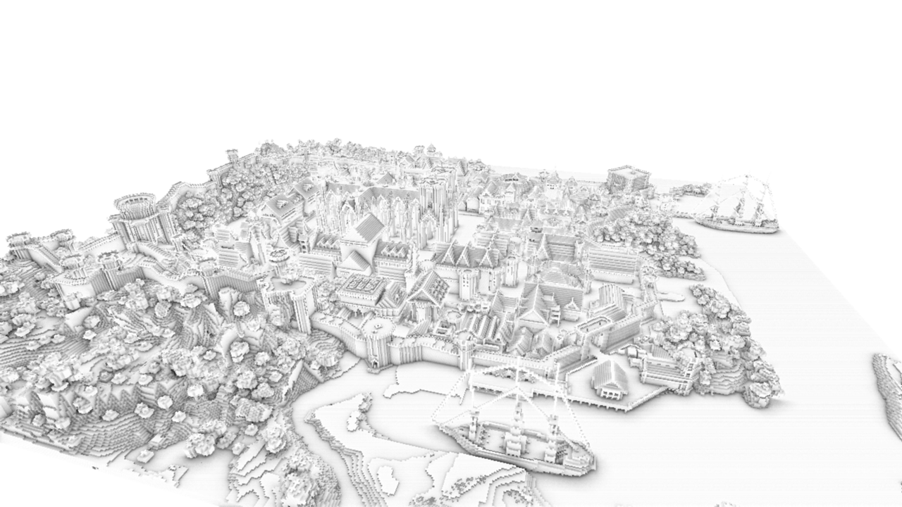
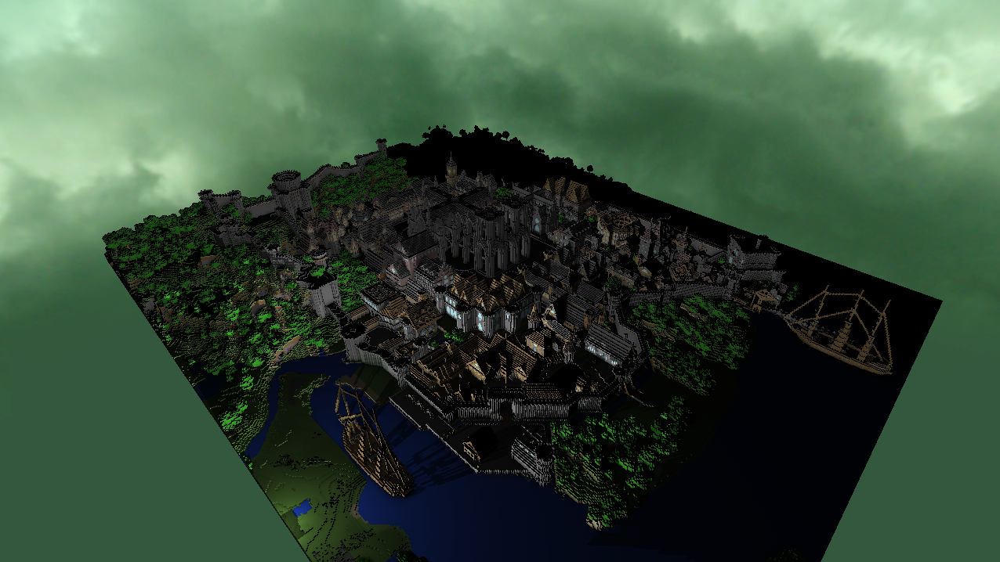

### A Rendering Engine written in C++ and OpenGL

*The Rungholt scene rendered with diffuse lighting, a single point light, SSAO, and shadow mapping*

### Overview ###
This rendering engine, which is still under development, is being used in "Array", an upcoming 3D puzzle-action game for Cornell's Advanced Game Design class. I am also using this as an opportunity to explore what it takes to create a complete rendering engine from scratch. The goal for this project is to create an engine capable of a toon-shading style with advanced post-processing effects and support for various light volumes while still being performant enough to support a real-time game.

<pre></pre>
The code is also available at my [github repository](https://github.com/JAGJ10/DeferredRenderer).

### Features ###
- **Deferred Pipeline** - Geometry is rendered into buffers in the first pass (position, normals, diffuse color, and depth) which allows the subsequent passes to only calculate lighting for the currently visible objects. This is the main advantage of deferred rendering compared to forward rendering where the lighting needs to be calculated on every object even if they are not visible.
- **Screen-Space Ambient Occlusion** - Using the hemisphere variant of the technique developed by Crytek, a cheap ambient occlusion calculation is made before lighting is computed. This gives a greater sense of depth by making "occluded" areas darker.
- **Light Volumes** - Point lights and spot lights are represented by meshes which allows the lighting calculations to only be performed on pixels within the affected area. This greatly decreases computational costs which is important when many lights are in the scene.
- **Directional Light Shadow Mapping** - A 2k resolution shadow map is created from the point of view of the sun for high quality shadows. Additionally, Percentage Closer Filtering is done to smooth out the shadows and remove aliasing artifacts.
- **Point Light Shadow Mapping** - 1k resolution shadow maps are generated for each point light in the scene. This is done by rendering a cube around the point light, and rendering a shadow map onto each cube face. This gives a local estimation of depth around each light enabling shadows to be calculated correctly. 
- **Skybox** - Rendering a skybox is done by using a clever method which first sets the gbuffer's FBO to read only followed by copying over the depth buffer through blitting. With the depth buffer, depth testing is enabled and the comparison is set to LEQUAL which means that the skybox can be rendered in a full-screen pass (much faster) and only where there is no other geometry present.

### Acknowledgements ###
I would like to personally thank Professor [Steve Marschner](http://www.cs.cornell.edu/~srm/) for his help and constant willingness to answer any and all questions.

### Screenshots ###

*SSAO combined with 50 randomly generated point lights placed throughout the scene with various colors*
<pre></pre>

*The result of the SSAO pass in the same scene as above (from a different angle)*
<pre></pre>

*A single point light with shadow mapping (notice the shadows cast by the ship)*

### Resources ###
Almost all of the resources used thus far have been tutorials and forums online. Since these are too numerous to list, I encourage anyone who is interested in learning more about deferred shading to start from the ground up and try creating their own. Throughout development I have found that there is no "correct" way of implementing the pipeline and that it all depends on what the engine is being used for.