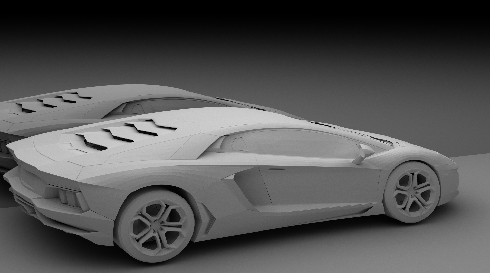

### A CUDA/C++ Path Tracer ###

*A lamborghini rendered in Hikari through purely indirect lighting after about 10,000 samples*

### Overview ###

Hikari (which means "light" in Japanese because I'm a nerd who likes anime :D ) is a physically-based uni-directional path tracer written in CUDA and C++. It's still in early development and supports very basic features, but the goal is to have an extremely fast path tracer capable of rendering photorealistic images.
<pre></pre>
It currently incorporates a fairly quick BVH builder using the SAH algorithm for quicker intersection testing. Additionally, simple rectangular area lights with light sampling are supported, along with diffuse and specular materials. Using CUDA's OpenGL interop capabilities, renders are piped to a live display which allows for moving around the scene in real-time and allows the render to converge gradually in the render view rather than having to wait for a set number of iterations to finish before having an image. Even with heavy geometry (such as the lamborghini), the live display is very quick due to only calculating direct lighting when the camera is in motion. Once the camera stops, secondary bounces are also computed allowing for proper "global illumination".

<pre></pre>
The code is also available at my [github repository](https://github.com/JAGJ10/Hikari).

### Future Work ###
- Disney BRDF for realistic and diverse materials
- A robust scene/file system for easier setup of scenes
- Importance sampling for quicker convergence
- Additional light shapes (spheres, disks, etc) would be nice to have

### Renders ###

*The stanford bunny with some diffuse spheres and a giant mirror rendered through purely indirect lighting*

### Resources ###

- [Sam Lapere's great blog on path tracing](http://raytracey.blogspot.com/)
- [Physically Based Rendering](http://www.pbrt.org/)
- [On fast Construction of SAH-based Bounding Volume Hierarchies](http://www.sci.utah.edu/~wald/Publications/2007/ParallelBVHBuild/fastbuild.pdf)