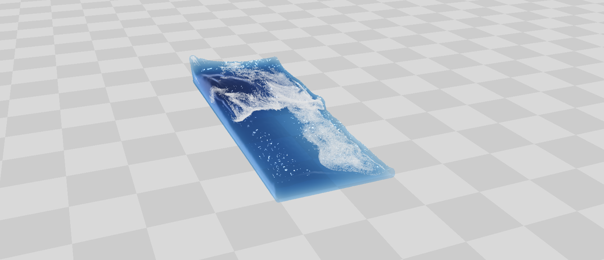

### A CUDA/C++ Fluid Simulation ###

*A frame from a Dam Break scene. 50k fluid particles and up to 500k diffuse particles were simulated at ~10-15 fps*

### Overview ###
This is an implementation of the paper [Position Based Fluids](http://mmacklin.com/pbf_sig_preprint.pdf) (Macklin 2013) I wrote from scratch to try my hand at a fluid simulation that could be run in real-time. Thanks to the parallel nature of the method, it is possible to run tens to hundreds of thousands of particles at interactive or nearly interactive frame rates. My implementation is capable of running 50k fluid particles with up to 500k diffuse particles at 10-15 fps on current hardware. OpenGL was used for the rendering. The official implementation (developed by Macklin and NVIDIA) can be seen in the [NVIDIA FleX framework](https://developer.nvidia.com/physx-flex).
<pre></pre>
This project was developed from Fall 2014 - Spring 2015.
<pre></pre>
The code is also available at my [github repository](https://github.com/JAGJ10/PositionBasedFluids).

### Features ###
- **Position Based Fluids** - The method behind the simulation. It is a lagrangian-based system which utilizes a Jacobi-style update allowing all particles to be run in parallel on the GPU.
- **Grid-based Neighbor Finding** - Each particle uses its current position as an index into a grid to insert itself for fast neighbor finding. This requires each particle to only check the 27 cells in its local area for neighbors within the smoothing radius.
- **Screen Space Fluid Rendering** - An extremely fast deferred rendering technique that uses several passes to reconstruct the fluid's surface. This is done by blurring over the depth buffer to create a smoothed image and a simple blending based on the "thickness" of the fluid for attenuating color.
- **Diffuse Particle Creation** - Fluid particles generate a "potential" for the creation of diffuse particles (foam, spray, and bubbles). This potential is based on their kinetic energy, current density, and position within the fluid. Once the potential crosses a threshold, diffuse particles are allocated from a pool.
- **Screen Space Foam Rendering** - Similar to Screen Space Fluid Rendering, several passes are made over the diffuse particles to create a representation of the foam including a fading effect based on the lifetime.
- **Rigid Body Collisions** - Meshes are sampled using a voxelization algorithm to place rigid body particles and the fluid density then takes into account a precomputed boundary value when the rigid particles are in the neighborhood. With the correct density, the fluid naturally aovids the rigid bodies.
- **Surface tension** - Surface tension and cohesion are computed as a result of neighboring particle attractions (based on a spline kernel) and a surface area minimization factor which helps to group the particles together while avoiding over-clumping.

### Acknowledgments ###
I would like to personally thank Professor [Doug James](http://www.cs.cornell.edu/~djames/), [Tim Langlois](http://www.cs.cornell.edu/~langlois/), [Eston Schweickart](http://www.cs.cornell.edu/~ers/), and [Miles Macklin](http://blog.mmacklin.com/) for their help and constant willingness to answer any and all questions.

### Future Work ###
The following papers are other methods that are currently in NVIDIA's FleX and would improve the simulation's realism.
<pre></pre>

- [Reconstructing Surfaces of Particle-Based Fluids Using Anisotropic Kernels](http://www.cc.gatech.edu/~turk/my_papers/particle_surfaces_tog.pdf)
- [Meshless Deformations Based on Shape Matching](https://www.cs.drexel.edu/~david/Classes/Papers/MeshlessDeformations_SIG05.pdf)

### Video ###
<iframe width="100%" height="720" src="https://www.youtube.com/embed/u2F53yr9uG0" frameborder="0" allowfullscreen>
</iframe>
*256k fluid particles and up to 500k diffuse particles were simulated at 8-10 fps*

<iframe width="100%" height="720" src="https://www.youtube.com/embed/9Wh3ano4kJw" frameborder="0" allowfullscreen>
</iframe>
*280k fluid particles and up to 2m diffuse particles were simulated at 2-4 fps*

### Resources ###

- [Position Based Fluids](http://mmacklin.com/pbf_sig_preprint.pdf) - The main paper which explains the solver for the simulation.
- [Screen Space Fluid Rendering](http://developer.download.nvidia.com/presentations/2010/gdc/Direct3D_Effects.pdf) - The main resource used for the rendering of the fluid.
- [Unified Spray, Foam and Bubbles for Particle-Based Fluids](http://cg.informatik.uni-freiburg.de/publications/2012_CGI_sprayFoamBubbles.pdf) - Used as a guide (with adjustments made by Miles Macklin) for the generation of diffuse particles.
- [Screen Space Foam Rendering](http://cg.informatik.uni-freiburg.de/publications/2013_WSCG_foamRendering.pdf) - The method (followed closely, but not exactly) for rendering diffuse particles.
- [Particle Simulation using CUDA](http://docs.nvidia.com/cuda/samples/5_Simulations/particles/doc/particles.pdf) - The method used for constructing the grid and neighbor finding.
- [Versatile Surface Tension and Adhesion for SPH Fluids](http://cg.informatik.uni-freiburg.de/publications/2013_SIGGRAPHASIA_surfaceTensionAdhesion.pdf) - The method used for simulating surface tension in a robust way
- [Versatile Rigid-Fluid Coupling for Incompressible SPH](https://www.semanticscholar.org/paper/Versatile-rigid-fluid-coupling-for-incompressible-Akinci-Ihmsen/0fcafa25b9557e35fbfa7e2190e4dc386255e950/pdf) - The method used for fluid-rigid collisions
