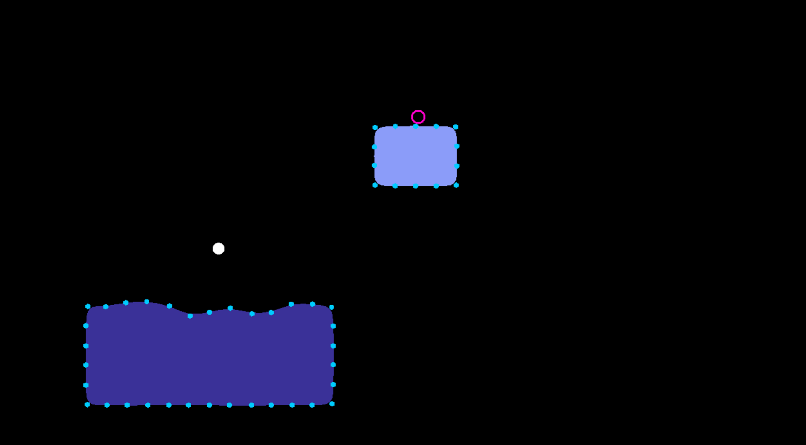
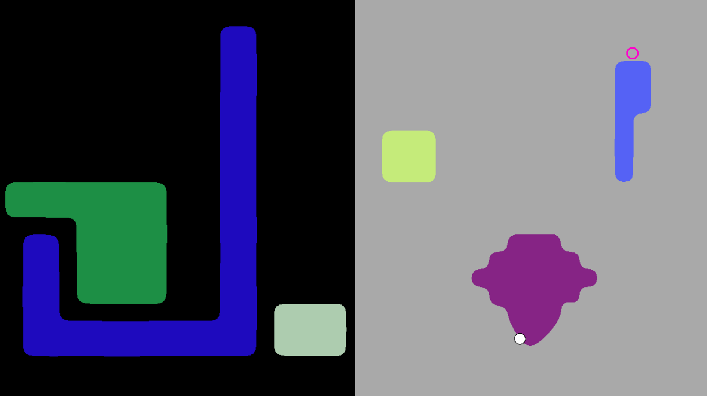

### A Platformer written in Actionscript 3 ###

*Wheeeee!*

### Overview ###
Rebound is an attempt to recreate the mechanics from the wonderful game [The Floor is Jelly](http://thefloorisjelly.com/) and then to add my own unique twist on it. My "twist" is the ability to walk around the jelly like a spider, meaning that it is possible to completely run around any of the floating jelly islands by simply holding the move key.

<pre></pre>
The code is also available at my [github repository](https://github.com/JAGJ10/Rebound). It also requires the Adobe Flex and AIR sdks.

### Challenges ###
The first major challenge that I faced was creating a robust(ish) level editor for creating islands of jelly. There used to be a post by the author of the game explaining how the islands were made although the page seems to no longer exist. That said, below is my attempt at a similar explanation. 

*The points making up the jelly*
<pre></pre>
In my implementation, the level is broken up into a simple grid and each jelly square is added by creating the 4 points at the corners. Each point stores its original position and then some simple pseudo-spring physics is used to make sure they always oscillate back to their starting point after a force is applied. Additionally, each point has a relationship with its two adjacent neighbors (on either side of it) which causes them to exert a force on each other. The jelly itself is drawn using bezier curves and filled in using the native graphics API. This creates a very pleasant oscillation effect which, depending on the values used, can almost look like water. In fact, in [Thermo](http://joelgross.me/projects/thermo.html), a similar system was used for the water.
<pre></pre>
When you have an entire island (multiple jelly squares that are adjacent), the points are sorted in clockwise order which is very important for the neighbor relationship. One of the tricky parts was that I wanted the ability to place jelly blocks in any order I felt like without being constrained. This meant that if I had two jelly islands and suddenly connected them, the points need to be re-sorted correctly. This is done by basically walking around the perimeter of jelly and keeping track of already visited points and potential cycles. The fact that the entire level can be represented as a simple 2d array made this much easier to implement.
<pre></pre>
The second major challenge was trying to enable the player to walk around the perimeter of the jelly seamlessly. In a typical 2D or 3D game, this could be done via raycasting and some clever bit of math. While this may have been a solution for me, it didn't seem to mesh very well with how I handle collisions in the game. This is because each jelly island is a polygon and I implement collisions by using the point in polygon algorithm. If the player is found to be inside the polygon, I find the two closest jelly points to his position and linearly interpolate between them such that the player ends up in the right place.
<pre></pre>
Of course, determining whether you are on a wall, upside-down, or rightside-up becomes much trickier when your "terrain" is just points floating in space. While this might be a complete and total hack (and I'm still not proud of it) I overcame this by checking each possible state that you could be in based on your position relative to the closest jelly points. Stated simply, I found the closest jelly point to the player (simple distance check once you are "inside" a polygon) and then checked your location relative to that jelly point's two neighbors. Once I figured out which wall, ceiling, or floor you were on, it became possible to then move in the appropriate direction.

### Acknowledgements ###
I would like to personally thank my advisor [Walker White](https://www.cs.cornell.edu/~wmwhite/) for his support of the project and all of the different ideas he let me bounce off him. A special thanks goes to [Ian Snyder](http://ianiselsewhere.com/) for taking the time to answer my questions and generously explaining some of his implementation.

### Screenshots ###

*A simple level from the game*
<pre></pre>

*This level is divided up into two "gravity" zones (idea borrowed from The Floor is Jelly)*
<pre></pre>
