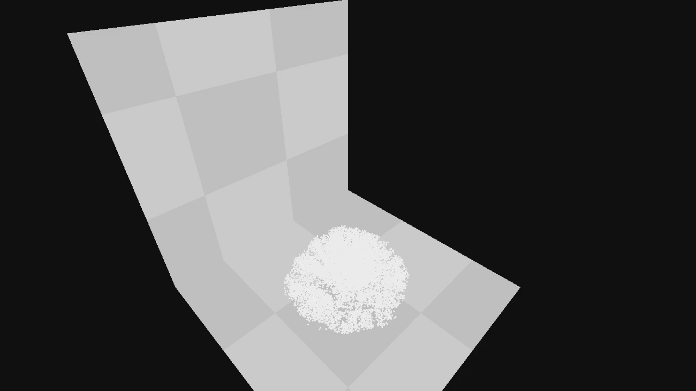

### A CUDA/C++ Snow Simulation ###

*A frame from a Snowball Drop scene.*

### Overview ###
This is an implementation of the paper [A material point method for snow simulation](https://www.math.ucla.edu/~jteran/papers/SSCTS13.pdf) (Stomakhin 2013) that I worked on with [Jeremy Cytryn](http://www.jeremycytryn.com/) as a final project for our Physically Based Animation class. Additionally, we successfully ported the method to the GPU via CUDA which allowed us to greatly increase the simulation times for our scenes. 

This project was developed during Spring 2015.

The code is also available at my [github repository](https://github.com/JAGJ10/Snow).

### Challenges ###
Over the course of this project we faced one key challenge: trying to find the correct combination of parameters and density. While we did try the parameter values laid out in the paper, we found that the results we were getting did not match the examples. This could be due to a difference in implementations, the fact that we used the explicit time-step vs. the implicit step, or something else. Many of our attempts would either result in very compressible snow (it would hit the ground and simply compress into itself) or rock-hard snow. Finding that right balance which results in fracture was extremely difficult. Looking at other people's results of this same paper it appears that this is a common problem.

### Acknowledgments ###
I would like to personally thank Professor [Doug James](http://www.cs.cornell.edu/~djames/) and [Tim Langlois](http://www.cs.cornell.edu/~langlois/) for their help and constant willingness to answer any and all questions. Of course I'd also like to thank my partner on this project, Jeremy, for all of the effort he put into it.

### Future Work ###
Many of the parameters from the paper could be tweaked further to get a more realistic fracture result. Additionally, it would be really nice to render the simulations in Houdini or Maya to make it look pretty.

### Video ###
<iframe width="100%" height="720" src="https://www.youtube.com/embed/Z9lHpgAtsqg" frameborder="0" allowfullscreen></iframe>
*Approximately 16k particles shown at around quarter-speed and rendered in 5 minutes*

### Resources ###

- [A material point method for snow simulation](https://www.math.ucla.edu/~jteran/papers/SSCTS13.pdf) - The main paper which explains the solver for the simulation.
- [Eric Jang's 3x3 SVD solver for CUDA](https://github.com/ericjang/svd3) - A great piece of open-sourced code (used in Eric's own implementation of this same paper) for computing the Singular Value Decomposition of a 3x3 matrix very quickly on the GPU. Other available SVD solvers for the GPU are typically meant for much larger matrices.
- [Computing the Singular Value Decomposition of 3x3 matrices with minimal branching and elementary floating point operations](http://pages.cs.wisc.edu/~sifakis/papers/SVD_TR1690.pdf) - The paper from which Eric's SVD solver is based.
- [My own Position Based Fluids](http://joelgross.me/projects/pbf.html) - A great basis for the CUDA work done in this project.