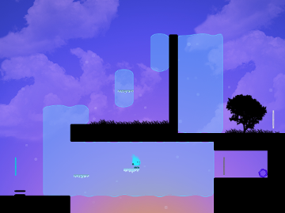
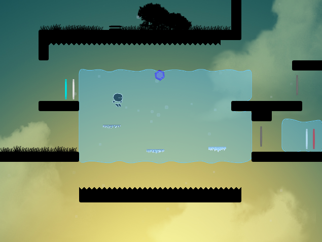
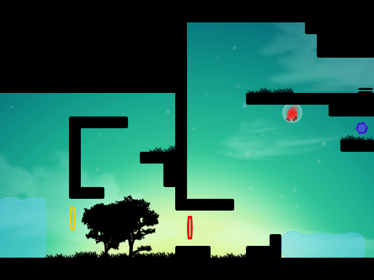
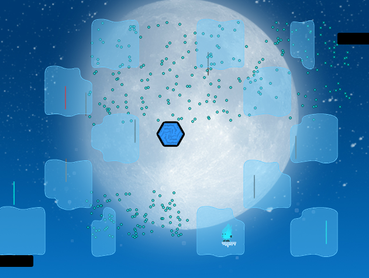

### A Puzzle-Platformer written in Actionscript 3 ###

<figure style="max-width:640px; margin: 0 auto;">
    
    <figcaption><em>A screenshot from a level in the game.</em></figcaption>
</figure>

### Overview ###
Thermo is a flash game written over the course of a semester for Cornell's Analytics-Driven Game Design class and has been released on Kongregate and Newgrounds. The game's mechanics revolve around your ability to manipulate the floating bodies of water by creating ice platforms or wrapping yourself in a bubble. Additionally, different colored "gates" (red, blue, and yellow) control which power you currently have access to. The restriction of resources, along with non-linear level design, created a variety of puzzles that made for an enjoyable experience.
<pre></pre>
A major part of development throughout the semester data logging and performing A/B testing to help determine which parts of the game were frustrating or unsuccessful.
<pre></pre>
Personally, I was responsible for the original idea, implementing the core gameplay mechanics, and most of the background and foreground art (excluding animations for the gates and character).
<pre></pre>
Upon release on Kongregate, Thermo was featured as a top game on the front page of the website for over two weeks and has gotten close to 45k plays. Additionally, across all of the sites it has been released to, more than 50k people have played it. The game was also reviewed by [Jayisgames.com](http://jayisgames.com/archives/2014/12/thermo.php).
<pre></pre>
The game can be found on [Kongregate](http://www.kongregate.com/games/jagj10/thermo).

### Acknowledgements ###
I would like to personally thank all of my wonderful teammates: [Kelvin Jin](http://kjin.me/), Daniel Carpenter, Robyn Nason, Andrew Wolfers, and Grace Ren. The game wouldn't have been possible without all of them.

### Screenshots ###
<figure style="max-width:640px; margin: 0 auto;">
    
</figure>
<figure style="max-width:640px; margin: 0 auto;">
    
</figure>
<figure style="max-width:640px; margin: 0 auto;">
    
</figure>